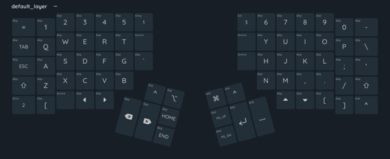
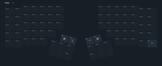
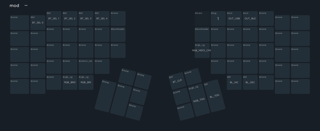

# ADV360-PRO-ZMK

[](https://jenkins.sudo.is/job/ben/job/kinesis360/job/main/)
[](https://git.sudo.is/ben/kinesis360/packages)
[](https://codeberg.org/benk/kinesis360)
[](https://git.sudo.is/ben/kinesis360)
[](https://github.com/benediktkr/kinesis360)
[](https://matrix.to/#/@ben:sudo.is)

## Overview

The repo forked [`KinesisCorporation/Adv360-Pro-ZMK`](https://github.com/KinesisCorporation/Adv360-Pro-ZMK)
at 45fca6f6010b50cec3e7f8df4fe4af4bad1e470e.

[](assets/key-positions.png)


Web config tools:
- [Adv360-Pro-GUI](https://kinesiscorporation.github.io/Adv360-Pro-GUI)
- [keymap-editor](https://nickcoutsos.github.io/keymap-editor/)

Manuals for Kinesis Advantage 360 Pro:

- [Quick start guide](manuals/Advantage360-Professional-QSG-v11-21-23_for-Web.pdf)
- [User's manual](manuals/Advantage360-ZMK-KB360-PRO-Users-Manual-v12-11-23.pdf)
- [Firmware update instructions](manuals/Advantage360-Professional-Firmware-Update-Instructions-11.22.23-KB360-PRO-GBR.pdf)
- [Reset instructions](manuals/Advantage360-Professional-Settings-Reset-Instructions-11.22.23-KB360-PRO-GBR.pdf)

See [`UPSTREAM.md`](UPSTREAM.md) for original `README.md` file.

## Layout

[](assets/base_layer.png)

[](assets/mac_layer.png)
[](assets/mod_layer.png)

## Builds

The default GitHub actions have been disabled and replaced with a [`Jenkinsfile`](Jenkinsfile)
and the [`Dockerfile`](Dockerfile) has been rewritten and improved.

To build the firmware:

```console
$ make
```

The `left.uf2` and `right.uf2` files are in a tarball `dist/firmware/Adv360-firmware_${VERSION}.tar.gz`.

### Flash a build

For each keyboard module:

1. Connect with USB
2. Put keyboard module into bootloader mode.
   - Left module: `Mod` + `Hotkey 1` (or reset button between `Backsapce` and `Del`).
   - Right module: `Mod` + `Hotkey 3` (or resett button between `Enter` and `Space`).
3. Mount as USB mass storage.
4. Copy `right.uf2` or `left.uf2`.
5. Disconnect USB as keyboard module reboots.

After flashing, use `Mod` + `V` to print the version of the flashed config.

## Git

|               | Repository
|:--------------|:---------------
| `git.sudo.is` | [`ben/kinesis360`](https://git.sudo.is/ben/kinesis360)
| Codeberg      | [`benk/kinesis360`](https://codeberg.org/benk/kinesis360)
| GitHub        | [`benediktkr/kinesis360`](https://github.com/benediktkr/kinesis360)


The `V3.0` branch of this repo tracks the main branch on of the `KinesisCorporation/Adv360-Pro-ZMK` repo.

```console
$ git remote add upstream https://github.com/KinesisCorporation/Adv360-Pro-ZMK
$ git fetch
$ git checkout --track upstream/V3.0
$ git branch --set-upstream-to=upstream/V3.0 V3.0
$ git pull upstream V3.0
```

In `.git/config` it looks like:

```ini
[branch "V3.0"]
        remote = upstream
        merge = refs/heads/V3.0
```

There are a couple of `.patch` files taken with `git diff`:

- [`upstream-changes.patch`](data/upstream-changes.patch): All changes to the upstream repo
  since the fork.
- [`upstream-changes-config.patch`](data/upstream-changes-config.patch): Upstream changes
  in `config/` since the fork. These are the **changes made to the upstream repo** since
  my fork. It **does not show how my config differs** from the upstream.
- [`diff-config.patch`](data/diff-config.patch): The diff between `config/` in this fork and
  current upstream. This how **my fork differs from current upstream**.


Updating the `.patch` files:

```console
$ git checkout V3.0
$ git pull upstream V3.0
$ fork=45fca6f6010b50cec3e7f8df4fe4af4bad1e470e
$ git diff $fork --no-prefix --patch -- config/ > data/upstream-changes-config.patch
```

```console
$ git checkout main
$ git diff V3.0 --no-prefix --patch -- config/ > data/diff-config.patch
```

## ZMK

- [ZMK Docs](https://www.zmk.dev/docs/)
  - [Supported Hardware](https://zmk.dev/docs/hardware#onboard): Advantage 360 Pro
  - [Configuration overview](https://zmk.dev/docs/config): Describes `Kconfig` and Devicetree file
    formats and how to change seetings in them. Lists [config file locations](https://zmk.dev/docs/config#config-file-locations)
    and what each config file does.
- [ZMK Cheat sheet](https://peccu.github.io/zmk-cheat-sheet/)
- [Zephyr Documentation](https://docs.zephyrproject.org/)

### Customized ZMK for Advantage 360

The Advantage 360 Pro uses [ZMK](https://www.zmk.dev), but it uses a customized version of ZMK that
is mainted in [`ReFil/zmk` on GitHub](https://github.com/ReFil/zmk/tree/adv360-z3.5).

Support Kinesis Advantage 360 has been merged in [`zmkfirmware/zmk#1454`](https://github.com/zmkfirmware/zmk/pull/1454),
which merged the `advantage360` branch from `ReFil/zmk`. But the [`west.yml`](config/west.yml) file
is still pointing to the `ReFil/zmk` repo (not sure why).

The config and build uses ZMK from the [`ReFil/zmk`](https://github.com/ReFil/zmk) repo. Currently
my builds are working using the `adv360-z3.2` branch. Upstream uses the `adv360-z3.5` branch, but
I currently get some errors building this config on that branch:

```text
warning: Deprecated symbol NRF_STORE_REBOOT_TYPE_GPREGRET is enabled.


warning: BT_SCAN_WITH_IDENTITY (defined at subsys/bluetooth/host/Kconfig:764) has direct dependencies
  !BT_PRIVACY && (BT_CENTRAL || BT_OBSERVER) && BT_HCI_HOST && BT_HCI && BT
  with value n, but is currently being y-selected by the following symbols:
```

Documentation is really sparse, but [`KinesisCoproration/Adv360-Pro-ZMK#251`](https://github.com/KinesisCorporation/Adv360-Pro-ZMK/issues/251)
says that `CONFIG_BT_PRIVACY` (IRK) cannot be enabled.

Full error: [`zmk-refil-adv360-z3.5-build-failure.txt`](data/zmk-refil-adv360-z3.5-build-failure.txt)

### Bluetooth

ZMK:
- [Features/Bluetooth](https://zmk.dev/docs/features/bluetooth)
- [Behaviors/Bluetooth](https://zmk.dev/docs/behaviors/bluetooth): keymap bindings related to Bluetooth
- [Configuration/Bluetooth](https://zmk.dev/docs/config/bluetooth)

Zephyr:
- [`CONFIG_BT_PRIVACY` - Zephyr Documentation](https://docs.zephyrproject.org/latest/kconfig.html#CONFIG_BT_PRIVACY)
- [`CONFIG_BT_BAS` - Zephyr Documentation](https://docs.zephyrproject.org/latest/kconfig.html#CONFIG_BT_BAS)

### Use Tap-Dance

Tap-Dance: https://zmk.dev/docs/behaviors/tap-dance

 * Both:         `tap` `C`     -> `C`
 * Normal layer: `tap,tap` `C` -> `ctrl C`
 * Mac layer:    `tap,tap` `C` -> `cmd C`

## Other configs

- [`git.sr.ht/~craftyguy`](https://git.sr.ht/~craftyguy/Adv360-Pro-ZMK)

